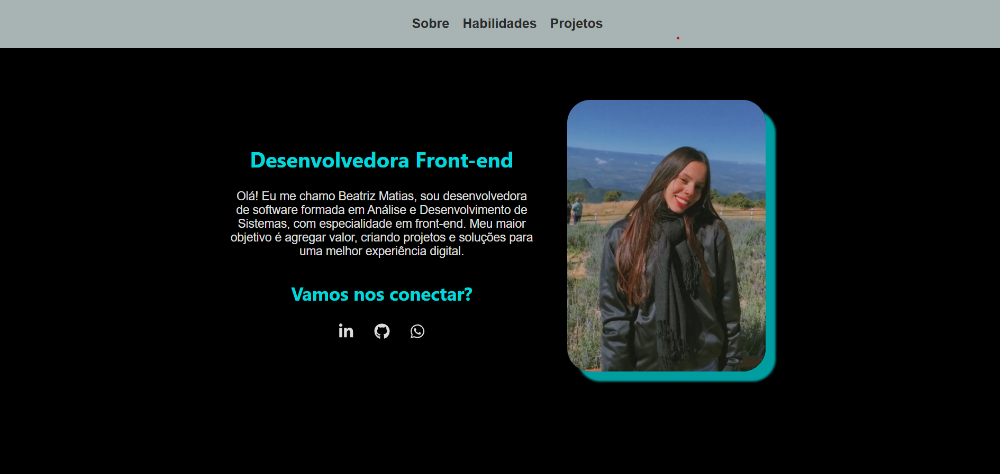

# Portfólio Pessoal



Este é o meu portfólio pessoal, criado com objetivo de apresentar meus projetos e habilidades como desenvolvedora front-end. 🚀

## Tecnologias Utilizadas

* React
* JavaScript
* Styled Components

## Como executar o projeto

### Clone o repositório:

```bash
git clone https://github.com/beamatias/Portfolio-Beatriz.git
```
### Instale as dependências:

```Bash
cd portfolio
```

```Bash
npm install
```
